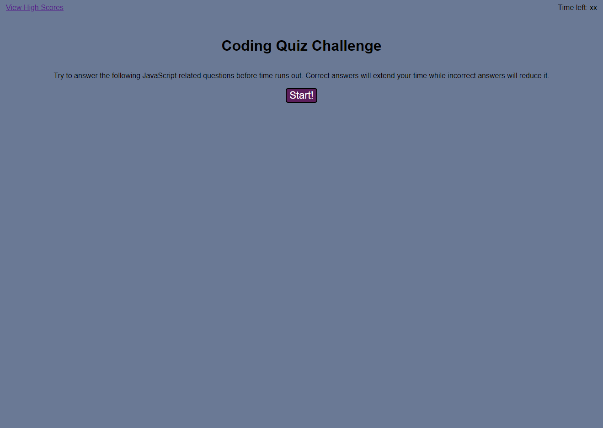

# Code Quiz
This page contains a very brief quiz on a handful of JavaScript topics. It is intended as a demonstration of what a timed quiz application that allows a user to answer a series of questions on a subject and receive a score that can be compared to that of their peers would look like - not so much an actual robust quiz on any one specific subject or aspect of JavaScript.

## Application
The application can be viewed [here](https://chocochip287.github.io/code-quiz-challenge/).

## Screenshot

